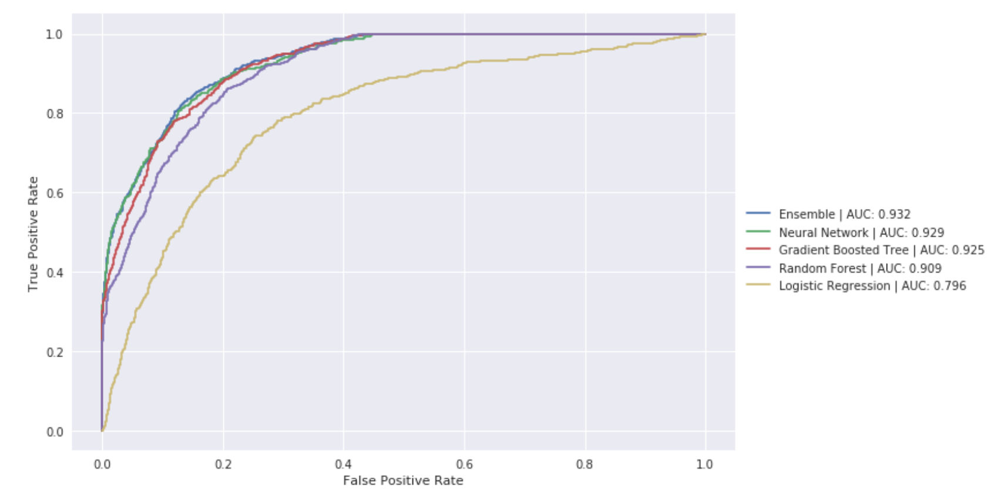

```{r setup, include=FALSE}
options(htmltools.dir.version = FALSE)
```

# Outline

.middle[
- Background
    - What problem are we solving?
    - Why not traditional methods?
    - How does deep learning help?
- Current Methods
    - What is a Neural Netowrk?
    - Recurrent Neural Networks
        - Long Short Term Memory models
    - Convolutional Neural Networks
    - Combining CNN and RNNs
    - Example with wearable data
    - Example with EHR data
- Problems & Possible Extensions
    - Sparse Classification
    - Computational Obstacles
    - Inference
    - Causality
    - Missing Data
]

---
class: inverse, center, middle

# Background
---

## What is continuous classification?

- The act of getting a continuous stream of input data ( $X$ ) and outputting a prediction of the state or class of the system generating that data at each time point. 

.center[]

- Sometimes called sequence labeling.
---
class: middle
## Why not traditional methods?

Traditional methods have a hard time with:

- Flexible time dependency windows
- Complex state transition patterns

---

## Sliding window methods

- A common approach to the problem is to slide window of some width over the data. 

- This limits the amount of time back your algorithm can use to infer about the current state 

.center[]

_This can be viewed as an inifinitely strong prior on time dependency lengths._ 
  
---
class: middle
## Hidden Markov Models

- Hidden Markov Models seem a natural fit to these type of data. We have a continuous stream of observed data that we wish to infer an underlying ('hidden') state from. 

But...

> A stochastic process has the Markov property if the conditional probability distribution of future states of the process (conditional on both past and present values) .highlight[depends only upon the present state;] that is, given the present, the future does not depend on the past. A process with this property is said to be Markovian or a Markov process. 
([Wikipedia Source](https://en.wikipedia.org/wiki/Markov_property))


- Think of an individual performing an interval run. Correct classification of the activity will depend on remembering that the user has been alternating between high and low heart rate, something a Markov chain can't deal with.

---

## Higher order Hidden Markov Models

- The time dependency window of a markov model can be extended, but at the cost of exponentially growing parameters. 

.center[]
.small[[image source](https://leonardoaraujosantos.gitbooks.io/artificial-inteligence/content/linear_algebra.html)]

- For viewing $\delta$ time steps back in a problem with $k$ possible states, the number of parameters needed to fill the transition matrix is $k^{\delta}$. Aka too big, quick.


---
## Transformation methods

- Methods like wavelet/fourier transforms are useless when the time series is relatively stable. 
- They require large amounts of feature engineering and makes the algorithms less flexible/ portable. 

.center[]
.small[[source](https://d3njjcbhbojbot.cloudfront.net/api/utilities/v1/imageproxy/https://coursera.s3.amazonaws.com/topics/dsp/large-icon.png)]

---
## How does deep learning solve these issues?

.pull-left[
- A neural network is a ['universal function approximator,'](http://mcneela.github.io/machine_learning/2017/03/21/Universal-Approximation-Theorem.html) aka with enough data and proper setup we could _theoretically_ do anything with them. 

- Lots of time and money has been invested in neural nets for time series data thanks to industry applications like Siri and Google Assistant. 

- Can be setup such that very little prior knowledge is required and features are discovered by the model. (Can we look into the black box?)
]

.pull-right[
.center[
]

.small[There really are some amazing datascience stock photos out there.]

]


---
class: inverse, center, middle

# Current Methods

---
## What is a (typical) Neural Network?

.pull-left.middeling[
- A linear mapping of inputs that are then 'squashed' by a non-linear activation function.

- Usually stacked in multiple 'layers' such that each layer's output acts as the input to the next layer.

- Really just another machine-learning technique, but a very flexible one.
]

.pull-right[
  
]


---
## How do we train them?

- While neural networks have been around for a long time (introduced in 1958 by Frank Rosenblatt), reasonable methods for training didn't really come around till 1986 with the introduction of the back propagation algorithm by Geoffrey Hinton.

- Back propigation calculates the gradient by applying the chain rule through the computational graph, then gradient descent is used to optimize parameters. 

.center[
  
]

---
## Training is hard

.pull-left.middeling[
- Neural nets are made up of lots of parameters that need to be tuned and thus they need lots of data.

- In addition, the optimization is non-convex.

- These combine to make training computationally rigerous.
]

.pull-right[
  
]

---
## Recurrent Neural Networks

.pull-left[
- Recurrent Nueral Networks (RNNs) deals with correlation in successive inputs by 'remembering' what they saw at the previous input. 
  
- Do this by feeding the values of the hidden layers to themselves at the next timestep. 
  
- Surprisingly, this cyclical connection doesn't break back-propigation...
]

.pull-right.center[

]

---
## RNN Problems

.pull-left[

- RNNs are actually feedforward neural networks, that fix the weights of many hidden layers to be the same as each other.

- When you multiply a state by a weight matrix many time(-steps) in a row you cause its values to either diverge to infinity or shrink to zero. This is known as the exploading and vanishing gradient problem.   

- This makes learning long-term time dependencies very hard for RNNs. 
    - Luckily, there are solutions. 
]

.pull-right.center[


.small[[source](https://deeplearning4j.org)]
]

---
## Long Short Term Memory models

- LSTMs help control the exploading and vanishing gradient problem by adding 'gates' that can decide to let through information/ control the flow of the gradient back in time. 

- These gates act as mediators for information flow, deciding when the hidden state should be added to, deleted from, and what it should pass on to the next layer. 

.center[

]

.small[[LSTMs as told by Baseball](http://livefreeordichotomize.com/2017/11/08/lstm-neural-nets-as-told-by-baseball/)]

---
## Code example

Here we train an LSTM to generate musings from Frank Harrell. The model doesn't know what a word is, it is only fed sequences of characters.

```{r, eval = F}
model <- keras_model_sequential()

model %>%
  layer_lstm(128, input_shape = c(maxlen, length(chars))) %>%
  layer_dense(num_characters) %>%
  layer_activation("softmax")

model %>% compile(
  loss = "categorical_crossentropy",
  optimizer = optimizer_rmsprop(lr = 0.01)
)
```


> ... subject the probabilities of x = 0.36 = (t) = 0.5528 and survival probable procedures as the residuals with the ordinal probability that the subset from the sample can also be two model predicted residuals and allow as a transformation conved in the full model and the full model

---
## Convolutional Networks (CNNs)

.pull-left.middeling[
- Slide feature detectors sequentially over data to detect patterns. 
    - These detectors are learned by the data, not programmed.


- Further layers aggregate detected features and make decisions based on their occurance/position.

- Avoids gradient problems from RNNs. 
]
.pull-right[

]

---

.middle.center[]

---
class: middle
## Convolutional vs Reccurent


In his book _Deep Learning with Python_, Francois Chollet (author of the deep learning library, Keras), gives the following advice on using RNNs or CNNs for sequence tasks. 

> If global order matters... then it is preferable to use a recurrent network... if global ordering isnt fundementally meaningful then 1d convnets will work at least as well and are cheaper. 

.small[Why not get the benefits of both...]

---
class: middle
## Convolutional Recurrent Networks

.pull-left.middeling[
- Feed the output from a CNN 'feature detector' over the data to be fed into RNN.  

- Much like a sliding window approach, but this time the model decides the aggregation function.
]
.pull-right[


.small[[source](http://www.abstractsonline.com/pp8/#!/4412/presentation/45220)]
]


---
## Example case of wearable data


.pull-left.middeling[

- Pletcher et al. released an [abstract](http://www.abstractsonline.com/pp8/#!/4412/presentation/45220) showing they had developed a high accuracy classifier for cardiovascular risk and sleep apnea using just heart rate and step counts from an apple watch. 

- They used a stack of 1d convolution followed by LSTM. 
]
.pull-right.middeling[

]

---
## Predicting 30-day readmission with an RNN

- Using data taken from Vanderbilt's synthetic derivative an LSTM neural network was fed sequential patient data (including IC9/CPT codes, BMI, administered drugs, etc) corresponding to a stay in the hospital and used it to predict if the patient would return in under 30 days. 

.center[
  
]

- Even with data devoid of time stamps, visits padded/truncated to equal length, and trained on smaller amounts of data than the other models, it was the top performing individual model we surveyed (barely).

---
class: inverse, center, middle

# Problems & Possible Extensions

---
## Sparse classification problem

- A lot of data, especially human data, has sparse/ inexact labels. 

.center[]

- How can we deal with this?

---

## Semi-Supervised learning

.pull-left[
- One way is to train an unsupervised model on all available data to find patterns in data
    - What type of unsupervised model?
  
- Then you can train a supervised model on top of the unsupervised models layers.

- Other methods include classifying unlabeled data and using the classifications as labels to retrain the model.
]

.pull-right.center[
  
  
  .small[[source](https://upload.wikimedia.org/wikipedia/commons/d/d0/Example_of_unlabeled_data_in_semisupervised_learning.png)]
]

---
## Computational obstacles

.pull-left.middeling[
- __Parameters:__ The flexability of neural networks comes at a cost: lots of parameters. 

- __Parallelization:__ For RNNs, in order to backpropagate, the computational graph needs to be unrolled limiting parallelization (back propigation through time).
]
.pull-right.center[


.small[Unrolled RNN computational graph.]
]

---
## Computational obstacles solutions

.pull-left[
__Parameters__
- Architectures like RNNs and CNNs reduce parameter numbers by weight sharing but have the aforementioned problems.
  
- LSTMs help with the vanishing/exploding gradient problem but introduce even more parameters. 
  
- We can also regularize (L2, L1, ...) but care needs to be taken. 
]

.pull-right[
__Parallelization__
- We can truncate our sequence length (but we know why that is dangerous.)

- Switch to an entirely convolutional framework to avoid the problems with back propigation through time. 
]

---
class: middle
## Inference

Can we get any insight out of a giant hairball of potentially millions of weights?

.center[
  
]

_[source](https://bbcomp.ini.rub.de/bbcomp-logo.png)_

---
## Inference Solutions

- Investigate _what_ the model learns by tracing the function compositions. 
- Generalized Adversarial Networks can help with this. 
- A disciplined way of doing this is needed. 

.center[
  
]
_Distil.pub's [feature visualization article](https://distill.pub/2017/feature-visualization/)_

---
## Causality

- Much like the bias-variance tradeoff in the sequence learning world there is a causality-accuracy tradeoff. 
- If we let the model look forward in time we [tend to get much better performance](https://arxiv.org/abs/1606.06871).
- However, if we want to either stream live data or attempt to make causal inferences we can't allow going forward in time. 

.center[
  
]
_[source](http://d3kbpzbmcynnmx.cloudfront.net/wp-content/uploads/2015/09/bidirectional-rnn.png)_

---
## Missing Data

.pull-left[
- What happens when a user takes off their fitbit to charge or a patient misses a scheduled appointment?
- Simple RNNs and CNNs make the assumption of evenly spaced time intervals. 
  - Could get around this by feeding info on the time since last visit/ input, but then we have more parameters. 
  - Imputation by unsupervised model is another potential, but may have un-obvious feedback effects. 
     - Denoising autoencoders, etc.
- Lots to learn from biostats here.

]


.pull-right[
  
]

---
class: inverse, center, middle

# Questions?


---
### Bibliography

.small[
- Bansal, N. K., Feng, X., Zhang, W., Wei, W., & Zhao, Y. (2012). Modeling Temporal Pattern and Event Detection using Hidden Markov Model with Application to a Sludge Bulking Data. Procedia Computer Science, 12, 218–223. http://doi.org/10.1016/j.procs.2012.09.059
- Dai, A. M., & Le, Q. V. (2015, November 4). Semi-supervised Sequence Learning. arXiv.org.
- Gehring, J., Auli, M., Grangier, D., Yarats, D., & Dauphin, Y. N. (2017, May 8). Convolutional Sequence to Sequence Learning. arXiv.org.
- Jozefowicz, R., Zaremba, W., 32nd, I. S. P. O. T., 2015. (n.d.). An empirical exploration of recurrent network architectures. Jmlr.org.
- Keren, G., & Schuller, B. (2016, February 18). Convolutional RNN: an Enhanced Model for Extracting Features from Sequential Data. arXiv.org.
- Lipton, Z. C., Berkowitz, J., & Elkan, C. (2015a, May 29). A Critical Review of Recurrent Neural Networks for Sequence Learning. arXiv.org.
- Lipton, Z. C., Kale, D. C., Elkan, C., & Wetzel, R. (2015b, November 11). Learning to Diagnose with LSTM Recurrent Neural Networks. arXiv.org.
- Malhotra, P., TV, V., Vig, L., Agarwal, P., & Shroff, G. (2017). TimeNet - Pre-trained deep recurrent neural network for time series classification. CoRR, cs.LG.
- Ronald. (2003). Neural Networks for Event Detection from Time Series: A BP Algorithm Approach, 1–10.
- Schuster, M., Signal, K. P. I. T. O., 1997. (n.d.). Bidirectional recurrent neural networks. Ieeexplore.Ieee.org.
- Strubell, E., Verga, P., Belanger, D., & McCallum, A. (2017, February 7). Fast and Accurate Entity Recognition with Iterated Dilated Convolutions. arXiv.org.
- van der Maaten RBM, L., 2009. (n.d.). Learning a parametric embedding by preserving local structure. Jmlr.org.
Wang, Z., & Oates, T. (2015, May 31). Imaging Time-Series to Improve Classification and Imputation. arXiv.org.
- Wang, Z., Yan, W., & Oates, T. (2016, November 19). Time Series Classification from Scratch with Deep Neural Networks: A Strong Baseline. arXiv.org.
- Zhang, X., Kou, W., Chang, E. I.-C., Gao, H., Fan, Y., & Xu, Y. (2017, November 2). Sleep Stage Classification Based on Multi-level Feature Learning and Recurrent Neural Networks via Wearable Device. arXiv.org.
]
