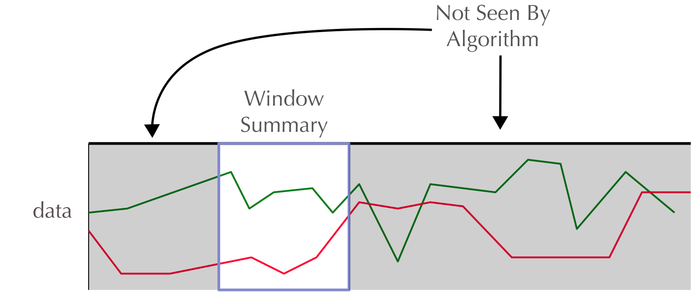

```{r setup, include=FALSE}
options(htmltools.dir.version = FALSE)
```

# Outline

.middle[
- Background
    - What problem are we solving?
    - Why not traditional methods?
    - How does deep learning help?
- Current Methods
    - Recurrent Neural Networks
    - Long Short Term Memory models
    - Convolutional add-ons
- Problems & Possible Extensions
    - Sparse Classification
    - Computational Obstacles
    - Inference
    - Causality
    - Missing Data
]

---
class: inverse, center, middle

# Background
---

# What is continuous classification?

The act of getting a continuous stream of input data ($X$) and outputting a prediction of the state or class of the system generating that data at each time point. 

.center[]

---
## Why not traditional methods?

- Traditional methods have a hard time with flexible time dependency windows
  - They usually use something like a sliding window approach which, by design, limits the amount of time back your algorithm can use to infer about the current situation. This is essentially an inifinitely strong prior. 
  
  .center[]

---
## What about Hidden Markov Models?

Hidden Markov Models seem a natural fit to these type of data. We have a continuous stream of observed data that we wish to infer an underlying ('hidden') state from. 

But...

> A stochastic process has the Markov property if the conditional probability distribution of future states of the process (conditional on both past and present values) depends only upon the present state; that is, given the present, the future does not depend on the past. A process with this property is said to be Markovian or a Markov process. 
([Wikipedia Source](https://en.wikipedia.org/wiki/Markov_property))

Think of an individual performing an interval run. Correct classification of the activity will depend on remembering that the user has been alternating between high and low heart rate, something a Markov chain can't deal with.

---
## Don't Electrical Engineers deal with this all the time?

- They do deal with similar problems, however, the data is almost always oscilatory. 
- Methods like wavelet/fourier transforms are useless when the time series is relatively stable. 
- Also, this requires large amounts of engineering and makes the algorithms less flexible. 

.center[]
[source](https://d3njjcbhbojbot.cloudfront.net/api/utilities/v1/imageproxy/https://coursera.s3.amazonaws.com/topics/dsp/large-icon.png)

---
## How does deep learning solve these issues?

- A neural network is a ['universal function approximator,'](http://mcneela.github.io/machine_learning/2017/03/21/Universal-Approximation-Theorem.html) aka with enough data and proper setup we could theoretically do anything with them. 
- Lots of time and money has been invested in neural nets for time series data thanks to industry applications like Siri and Google Assistant. 
- Can be setup such that very little prior knowledge is required and features are discovered by the model. (Can we look into the black box?)

.center[

]
_There really are some amazing datascience stock photos out there._

---
class: inverse, center, middle

# Current Methods

---
## What is a (typical) Neural Network?

- A linear mapping of inputs that are then 'squashed' by an activation function.
- Usually stacked in multiple 'layers' such that each layer's output acts as the input to the next layer. 
- Non-linear and non-convex. Aka trained via gradient descent through a method called "back-propagation."


.center[

]
[source](https://www.pyimagesearch.com/wp-content/uploads/2016/08/simple_neural_network_header.jpg)

---
## Recurrent Neural Networks

- Deals with correlation in successive inputs by 'remembering' what it saw at the previous input. 

.center[

]


---
## Long Short Term Memory models

- RNNs are trained by back propagating through their unrolled computational graph.
- Because of how backprop works this means repeated multiplication of the gradients, causing them to explode or vanish. 
- LSTMs prevent these problems by adding 'gates' that can decide to let through information/ control the flow of the gradient back in time. 

.center[

]


---
class: middle
## Convolutional add-ons

.pull-left[
- Slide a 'feature detector' over the data to be fed into RNN.  
- Much like a sliding window approach, but this time the model decides the aggregation function.
- Used extensively in computer vision. 
]
.pull-right[

]


---
### Example case of wearable data


.pull-left[

Pletcher et al. released an [abstract](http://www.abstractsonline.com/pp8/#!/4412/presentation/45220) showing they had developed a high accuracy classifier for cardiovascular risk and sleep apnea using just heart rate and step counts from an apple watch. 

They used a stack of 1d convolution followed by LSTM. 
]
.pull-right[

]

---
class: inverse, center, middle

# Problems & Possible Extensions

---
## Sparse classification problem

- A lot of data, especially human data, has sparse/ inexact labels. 


---
## Sparse classification solution

- Semi-Supervised learning. 
- Train an unsupervised model on all available data to find patterns in data
  - Which type? 
- Train supervised model on top of the unsupervised layers. 

.center[
  
]

---
## Computational obstacles

- This flexibility has a cost, lots of parameters. 
- In order to backpropigate the computational graph needs to be unrolled limiting parallelization.

.center[

]
_I googled "computer working hard." [source](https://www.cyberciti.biz/media/new/cms/2016/10/cat-intrns.jpg)_

---
## Computational obstacles solutions

.pull-left[
__Parameters__
  - RNNs reduce parameter numbers by weight sharing but have the aforementioned exploding/vanishing gradient problem
  - LSTMs help with the vanishing/exploding gradient problem but introduce even more parameters. 
  - We can also regularize (L2, L1, ...) but care needs to be taken. 
]

.pull-right[
__Parallelization__
  - We can truncate our sequence length (but we know why that is dangerous)
  - Some newer architectures forgo RNNs and use exclusively CNNs (Dilated ConvNets) and are thus parallelizable.

]

---
## Inference

How can we possibly get any insite out of a giant hairball potentially millions of weights and abundent overfitting?

.center[
  
]

_[source](https://bbcomp.ini.rub.de/bbcomp-logo.png)_

---
## Inference Solutions

- Investigate _what_ the model learns by tracing the function compositions. 
- Generalized Adversarial Networks can help with this. 
- We need a disciplined way of doing this. 

.center[
  
]
_Distil.pub's [feature visualization article](https://distill.pub/2017/feature-visualization/)_

---
## Causality

- Much like the bias-variance tradeoff in the sequence learning world there is a causality-accuracy tradeoff. 
- If we let the model look forward in time we [tend to get much better performance](https://arxiv.org/abs/1606.06871)
- However, if we want to either stream live data or attempt to make causal inferences we can't allow going forward in time. 

.center[
  
]
_[source](http://d3kbpzbmcynnmx.cloudfront.net/wp-content/uploads/2015/09/bidirectional-rnn.png)_

---
## Missing Data

.pull-left[
- What happens when a user takes off their fitbit to charge or a patient misses a scheduled appointment?
- Simple RNNs make the assumption of evenly spaced time intervals. 
  - Could get around this by feeding info on the time since last visit/ input, but then we have more parameters. 
  - Imputation by unsupervised model is another potential, but may have un-obvious feedback effects. 
  - Lots to learn from biostats here.

]


.pull-right[
  
]

---
### Bibliography

.small[
- Bansal, N. K., Feng, X., Zhang, W., Wei, W., & Zhao, Y. (2012). Modeling Temporal Pattern and Event Detection using Hidden Markov Model with Application to a Sludge Bulking Data. Procedia Computer Science, 12, 218–223. http://doi.org/10.1016/j.procs.2012.09.059
- Dai, A. M., & Le, Q. V. (2015, November 4). Semi-supervised Sequence Learning. arXiv.org.
- Gehring, J., Auli, M., Grangier, D., Yarats, D., & Dauphin, Y. N. (2017, May 8). Convolutional Sequence to Sequence Learning. arXiv.org.
- Jozefowicz, R., Zaremba, W., 32nd, I. S. P. O. T., 2015. (n.d.). An empirical exploration of recurrent network architectures. Jmlr.org.
- Keren, G., & Schuller, B. (2016, February 18). Convolutional RNN: an Enhanced Model for Extracting Features from Sequential Data. arXiv.org.
- Lipton, Z. C., Berkowitz, J., & Elkan, C. (2015a, May 29). A Critical Review of Recurrent Neural Networks for Sequence Learning. arXiv.org.
- Lipton, Z. C., Kale, D. C., Elkan, C., & Wetzel, R. (2015b, November 11). Learning to Diagnose with LSTM Recurrent Neural Networks. arXiv.org.
- Malhotra, P., TV, V., Vig, L., Agarwal, P., & Shroff, G. (2017). TimeNet - Pre-trained deep recurrent neural network for time series classification. CoRR, cs.LG.
- Ronald. (2003). Neural Networks for Event Detection from Time Series: A BP Algorithm Approach, 1–10.
- Schuster, M., Signal, K. P. I. T. O., 1997. (n.d.). Bidirectional recurrent neural networks. Ieeexplore.Ieee.org.
- Strubell, E., Verga, P., Belanger, D., & McCallum, A. (2017, February 7). Fast and Accurate Entity Recognition with Iterated Dilated Convolutions. arXiv.org.
- van der Maaten RBM, L., 2009. (n.d.). Learning a parametric embedding by preserving local structure. Jmlr.org.
Wang, Z., & Oates, T. (2015, May 31). Imaging Time-Series to Improve Classification and Imputation. arXiv.org.
- Wang, Z., Yan, W., & Oates, T. (2016, November 19). Time Series Classification from Scratch with Deep Neural Networks: A Strong Baseline. arXiv.org.
- Zhang, X., Kou, W., Chang, E. I.-C., Gao, H., Fan, Y., & Xu, Y. (2017, November 2). Sleep Stage Classification Based on Multi-level Feature Learning and Recurrent Neural Networks via Wearable Device. arXiv.org.
]
